# 03 · Modelo de datos y RLS

> **Fuente de verdad de este documento: `supabase/migrations/0001…0047_*.sql`.**
> No me conecté a la DB en vivo por decisión explícita del usuario. Si el estado remoto divergió (cambios manuales desde Studio, hotfixes aplicados directamente contra prod, index dropeados a mano), no lo vamos a ver acá. Al final del documento hay un bloque de queries `SELECT` para correr manualmente y verificar convergencia.

Fecha del snapshot: 2026-07-23. Postgres 17 (según `supabase/config.toml:42`).

---

## 3.1 Multi-tenant, en 3 líneas

- **Columna del tenant**: `project_id uuid` con FK a `projects(id) ON DELETE CASCADE`. Aparece **directa** en 25 tablas; en 9 tablas se resuelve vía función SECURITY DEFINER (`project_of_launch`, `project_of_sale`, `project_of_bank`, `project_of_commission_rule`).
- **Membership**: junction `project_members (project_id, user_id)` — un user "pertenece" al tenant sólo si tiene fila acá (o es `superadmin`).
- **Roles reales en DB** (`profiles.role`, CHECK en `0034_dev_role_and_audit.sql:541-543`):
  `dev`, `superadmin`, `admin`, `operador`, `analista`, `cliente`.
  El `dev` **no** es asignable vía UI ni raw_user_meta_data — `handle_new_user` lo degrada a `cliente` (`0034_dev_role_and_audit.sql:556-559`) y `guard_profile_role` sólo lo permite vía `service_role` (`0034_dev_role_and_audit.sql:586-596`).

Discrepancia dura con `docs/AUDITORIA.md:15-22` (afirma "3 roles: superadmin/admin/cliente"). Hoy hay **6**. `operador` y `analista` no están documentados fuera del código; `dev` está oculto por diseño.

---

## 3.2 Helpers SECURITY DEFINER (base de todas las RLS)

Toda policy se apoya en estas funciones para centralizar la lógica de permisos. Todas son `stable`, `set search_path = public`.

| Función | Retorno | Archivo:línea | Qué chequea |
| --- | --- | --- | --- |
| `is_superadmin()` | bool | `0002_functions.sql:11-25` | Caller tiene `profiles.role = 'superadmin'` |
| `has_project_access(uuid)` | bool | `0002_functions.sql:31-45` | Superadmin **o** existe fila en `project_members` para el user y proyecto |
| `can_edit_project(uuid)` | bool | `0002_functions.sql:56-72` | Superadmin **o** (`profiles.role = 'admin'` **y** miembro del proyecto) |
| `project_of_launch(uuid)` | uuid | `0002_functions.sql:79-…` | Resuelve `launches.project_id` |
| `can_edit_launches_in(uuid)` | bool | `0010_back_to_project_scope.sql:60-…` | Admin + `operador` — el gate típico de "gente que carga datos día a día" |
| `project_of_sale(uuid)` | uuid | `0014_sales_and_commissions.sql:198-206` | Resuelve `sales.project_id` (aún usado por triggers) |
| `project_of_commission_rule(uuid)` | uuid | `0031_commission_tiers.sql:125` | Resuelve project de una regla |
| `project_of_bank(uuid)` | uuid | `0044_banks.sql:76-84` | Resuelve `banks.project_id` |
| `is_cliente()` | bool | `0023_cliente_role_frontier.sql:66-79` | `profiles.role = 'cliente'` |
| `user_role_is_team()` | bool | `0024_notifications.sql:132-157` | Rol en `{superadmin, admin, operador}` — plpgsql para no depender de `search_path` en compile-time |
| `is_dev()` | bool | `0034_dev_role_and_audit.sql:115-…` | `profiles.role = 'dev'` |
| `custom_access_token_hook(jsonb)` | jsonb | `0023_cliente_role_frontier.sql:93-116` | Hook Supabase Auth: si `profiles.role = 'cliente'`, mapea `claims.role → 'cliente_role'` |

**Nota**: la distinción funcional entre `superadmin` y `admin` está intencionalmente colapsada dentro de `can_edit_project` (`0002_functions.sql:52-54`). Cambiar la semántica es tocar **un** archivo. Bueno para el subdominio: si se define un nuevo rol "growins_operator", vive acá.

---

## 3.3 Catálogo de tablas (por dominio)

### 3.3.1 Core / tenancy / auth

| Tabla | Creación | Columnas clave | Notas |
| --- | --- | --- | --- |
| `profiles` | `0001_schema.sql:12-19` | `id uuid PK → auth.users`, `full_name text`, `role text check(...)`, `deleted_at timestamptz` (`0005:15`) | Soft-delete en 0005. Rol extendido a 6 valores en 0034. |
| `projects` | `0001_schema.sql:26-33` | `id uuid PK`, `name text NOT NULL`, `business_name text`, `created_by uuid → auth.users` | El tenant raíz. |
| `project_members` | `0001_schema.sql:38-43` | PK compuesta `(project_id, user_id)` | Sin rol propio — el rol vive en `profiles.role`. |
| `audit_log` | `0001:149-156` → **dropeada y recreada** en `0034_dev_role_and_audit.sql:139-141` | `id`, `project_id`, `user_id`, `ts`, `action`, `detail jsonb` | Trigger genérico `record_audit()` (`0034:205`) attacheado por `_attach_audit_trigger` (`0034:250`). |
| `auth_events` | `0034_dev_role_and_audit.sql:175-…` | `id`, `user_id`, `event_type`, `ts`, `ip`, `user_agent` | Log de sesiones. Read: sólo `is_dev()`. |
| `project_secrets` | `0001:136-144`, RLS en `0003:184` | `provider text`, `secret text`, unique `(project_id, provider)` | **BLINDADA**: RLS on, cero policies → sólo service-role. |

### 3.3.2 Launches + integraciones + ads

| Tabla | Creación | Notas |
| --- | --- | --- |
| `launches` | `0001:50-86`; evolucionada por `0006`, `0011`, `0012`, `0028`, `0033`, `0037` | Ver §3.5 abajo para el listado completo de columnas actual. |
| `launch_daily` | `0001:94-110` | 1 fila por (launch, date) con 7 canales de leads. Unique `(launch_id, date)`. |
| `launch_daily_ads` | `0012:68-83` | Datos sintetizados de Meta/Google/TikTok. Unique `(launch_id, date, provider)`. **RLS sólo SELECT + service-role escribe** (sin policies I/U/D). |
| `launch_secrets` | `0012:37-45` | Token por (launch, provider). **BLINDADA** igual que `project_secrets`. |
| `project_integrations` | `0001:117-129` | Metadata de conexión (`connected`, `account_id`, `last_sync`, `config jsonb`). Unique `(project_id, provider)`. |
| `integration_runs` | `0012:113-130` | Log de cada sync. `status text check(...)` con 7 valores (ver §3.7). |
| `launch_opportunities` | `0022:24-60` | Opps de GHL. `status ∈ {open,won,lost,abandoned}`. Unique `(project_id, external_id)`. Escribe sólo service-role. |
| `launch_community_metrics` | `0029:33-53` | Métrica SendFlow por (launch, window). Sólo `provider = 'sendflow'`. |
| `launch_messages_daily` | `0035:27-51` | Conteo diario de inbound WhatsApp/SMS por launch. Sólo service-role escribe. |
| `alert_rules` | `0025:29-48` | 3 métricas hardcoded (`cpl`, `inversion`, `sin_leads`). Unique `(launch_id, metric, operator, threshold)`. |
| `ghl_user_mappings` | `0021:20-31` | Traduce `ghl_user_id → team_member_id`. Unique `(project_id, ghl_user_id)`. |

### 3.3.3 CRM (leads + equipo)

| Tabla | Creación | Notas |
| --- | --- | --- |
| `team_members` | `0013:34-45` | Sin FK a `auth.users` — es metadata, no usuarios del sistema. `role ∈ {setter,closer,media_buyer,manager,otro}`. `commission_rate` deprecado desde tiers (0031). |
| `leads` | `0013:89-107` + extensiones `0016,0018,0023,0028` | Ver §3.5 abajo. |

### 3.3.4 Ventas + cobros + comisiones

| Tabla | Creación | Notas |
| --- | --- | --- |
| `sales` | `0014:141-155` + `0038` (`product_id`), `0041` (`launch_id`, drop unique), `0043` (`installment_count`, `installment_frequency`, `grace_days`) | Ver §3.5. |
| `payments` | `0014:208-216` + `0045` (`project_id` denorm + trigger + policies re-escritas) | append-only (`amount > 0`), fecha `paid_at date default current_date`. |
| `payment_modalities` | `0014:27-35` | Unique `(project_id, name)`. Sólo `can_edit_project` escribe (admin+). |
| `products` | `0038:31-41` | `on delete restrict` desde `sales.product_id` — bloquea borrado si tiene ventas. |
| `payment_methods` | `0043:48-56` | `bank_id` nullable — link a `banks` en 0044. |
| `installments` | `0043:92-101` | Unique `(sale_id, number)`. `payments.installment_id` es nullable — regen deja huérfanos. |
| `commission_rules` | `0014:82-95` + `0031,0039,0040,0042` | Ver evolución en §3.8. |
| `commission_rule_tiers` | `0031:102-114` | Tramos marginales por cantidad de ventas del miembro. Unique `(rule_id, min_count)`. |
| `commission_rule_modalities` | `0031:161-…` | M:N regla ↔ modalidad. Trigger `check_commission_rule_modality_unique` (`0031:191`). |
| `team_member_payouts` | `0030:19-32` | Pagos al equipo. `launch_id` NOT NULL — se atribuyen por launch. |
| `banks` | `0044:30-40` | Unique `(project_id, name)`. |
| `bank_movements` | `0044:87-97` | Movimientos manuales (in/out) que **no** son cobros de ventas. |

### 3.3.5 IA + notificaciones + calculadora

| Tabla | Creación | Notas |
| --- | --- | --- |
| `ai_runs` | `0015:24-38` | Historial de análisis. **UPDATE revocado explícito a `authenticated`** (`0015:44` — nota de `feedback_supabase_default_privileges`). |
| `notifications` | `0024:64-90` | `target_role XOR target_user_id` (constraint `notifications_target_xor`). Dedup por `(project_id, dedup_key)` con `nulls not distinct`. |
| `projections` | `0007:12-22` | Snapshots de la calculadora. Guarda `inputs` + `outputs` para preservar cálculos históricos. |

### 3.3.6 Tabla dropeada (histórico)

| Tabla | Creada | Dropeada | Motivo |
| --- | --- | --- | --- |
| `launch_assignments` | `0008_roles_and_launch_assignments.sql:57` | `0010_back_to_project_scope.sql:45` | Rollback de scope per-launch → scope per-project. Ver §3.8 anomalías. |

**Total tablas activas: 34** (contando `auth_events`; el agente había reportado 33 sin contarla). Actualizo el número respecto al reporte `_schema-raw.md`.

---

## 3.4 Diagrama ER (Mermaid)

Sólo relaciones estructurales (FK). Omito `updated_at` triggers y todo lo derivable. Colores conceptuales por dominio.

```mermaid
erDiagram
    profiles ||--o| auth_users : "1:1 by id"
    projects ||--o{ project_members : "N members"
    profiles ||--o{ project_members : "user_id"
    projects ||--o{ launches : "1:N"
    projects ||--o{ project_integrations : "1:N unique(provider)"
    projects ||--o{ project_secrets : "1:N BLINDED"
    projects ||--o{ audit_log : "1:N"
    projects ||--o{ projections : "1:N"

    launches ||--o{ launch_daily : "1:N unique(date)"
    launches ||--o{ launch_daily_ads : "1:N unique(date,provider) SVC-ONLY"
    launches ||--o{ launch_secrets : "1:N BLINDED"
    launches ||--o{ integration_runs : "1:N"
    launches ||--o{ launch_opportunities : "1:N SVC-ONLY"
    launches ||--o{ launch_community_metrics : "1:N SVC-ONLY"
    launches ||--o{ launch_messages_daily : "1:N SVC-ONLY"
    launches ||--o{ alert_rules : "1:N"
    launches ||--o| launches : "recycle_target_launch_id"

    projects ||--o{ team_members : "1:N"
    projects ||--o{ leads : "1:N phone_unique_partial"
    launches ||--o{ leads : "0:N (nullable)"
    team_members ||--o{ leads : "team_member_id"
    launches ||--o{ leads : "recycled_from_launch_id"

    projects ||--o{ payment_modalities : "1:N unique(name)"
    projects ||--o{ products : "1:N unique(name)"
    projects ||--o{ payment_methods : "1:N unique(name)"
    projects ||--o{ banks : "1:N unique(name)"
    banks ||--o{ bank_movements : "1:N"
    payment_methods }o--o| banks : "bank_id nullable"

    projects ||--o{ sales : "1:N (denorm)"
    leads ||--o{ sales : "1:N (multi-sale Fase 8)"
    launches ||--o{ sales : "0:N (Fase 8 nullable)"
    team_members ||--o{ sales : "0:N (drift, ver 0047)"
    payment_modalities ||--o{ sales : "restrict"
    products ||--o{ sales : "restrict"

    sales ||--o{ payments : "1:N (project_id denorm 0045)"
    projects ||--o{ payments : "denorm 0045"
    sales ||--o{ installments : "1:N unique(number)"
    installments ||--o{ payments : "0:N nullable"
    payment_methods ||--o{ payments : "0:N nullable"

    projects ||--o{ commission_rules : "1:N"
    launches ||--o{ commission_rules : "override opcional"
    commission_rules ||--o{ commission_rule_tiers : "1:N unique(min_count)"
    commission_rules ||--o{ commission_rule_modalities : "M:N pivot"
    payment_modalities ||--o{ commission_rule_modalities : "M:N pivot"

    projects ||--o{ team_member_payouts : "1:N"
    team_members ||--o{ team_member_payouts : "1:N"
    launches ||--o{ team_member_payouts : "1:N NOT NULL"

    projects ||--o{ ghl_user_mappings : "1:N unique(ghl_user_id)"
    team_members ||--o{ ghl_user_mappings : "1:N"

    projects ||--o{ notifications : "1:N"
    launches ||--o{ notifications : "0:N nullable"
    profiles ||--o{ notifications : "target_user_id nullable"

    projects ||--o{ ai_runs : "1:N (UPDATE revoked)"
    launches ||--o{ ai_runs : "1:N"

    auth_users ||--o{ auth_events : "1:N (dev-only read)"
```



Convenciones marcadas:

- `SVC-ONLY` = tabla con RLS on pero **sólo `SELECT` policy**: escritura solo con service-role. Aplica a `launch_daily_ads`, `launch_opportunities`, `launch_community_metrics`, `launch_messages_daily`, `integration_runs` (I/U/D).
- `BLINDED` = RLS on con **cero policies** → nadie via PostgREST lee ni escribe salvo service-role. Aplica a `project_secrets`, `launch_secrets`.
- `denorm 0045` = `payments.project_id` es redundante con `project_of_sale(sale_id)`; se mantiene por trigger para acelerar RLS a volumen (ver `0045_payments_project_id.sql`).
- `drift` = `sales.team_member_id` puede divergir de `leads.team_member_id`; el leaderboard RPC (0047) usa el del lead como autoritativo.

---

## 3.5 Columnas críticas por tabla (subset)

Enumero sólo las tablas de gran uso o con evolución no obvia. El resto está en el archivo de migración correspondiente.

### `launches` (mig 0001+0006+0011+0012+0028+0033+0037)

- Identidad: `id`, `project_id`, `name`, `type ∈ {En Vivo, Automatizado, Replay}` (`0001:55`), `status ∈ {Activo, Escalando, Finalizado, Evergreen}` (`0001:56`), `platforms text[]`.
- Ventana:
  - Antes: `date` (deprecada, `0001:54`) y `date_start`/`date_end` manuales (`0006:98-99`).
  - Ahora: `launch_date date` (fecha ancla) + `dur_creacion` (default 30, `0037:19`), `dur_nutricion` (default 15, `0037:20`), `dur_captacion` (21, `0011:146`), `dur_calentamiento` (14, `0011:147`), `dur_compra` (5, `0011:148`), `dur_cierre` (3, `0011:149`). `date_start` y `date_end` son **GENERATED ALWAYS AS STORED** (`0011:196-…`).
- Estado: `closed_at timestamptz` (`0006:100`).
- Evergreen: `is_evergreen bool default false` (`0028:432`), `recycle_target_launch_id uuid` (`0028:434`) con constraints `evergreen ↔ has_target` (`0028:439-443`) y `no_self_recycle` (`0028:446-450`).
- Ads/lifecycle (viejas, aún vigentes como fallback manual): `meta_*`, `google_*`, `tiktok_*`, `contactos_api`, `ingresos_whatsapp`, `registrados`, `asistentes`, `hasta_pitch`, `ventas_total`, `ventas_mensuales`, `ventas_anuales`.
- Revenue split (0033): `revenue` fue **renombrada a `revenue_estimated_manual`** (`0033:505-506`) — ¡ojo con código legacy que asuma la columna vieja! `revenue_collected_manual numeric(14,2)` agregada (`0033:513-514`).
- Metadata sync: `integration_config jsonb` (`0012:29`), `sources jsonb` (`0001:82`).

### `leads` (mig 0013+0016+0018+0028)

- Identidad: `id`, `project_id`, `launch_id` (nullable), `team_member_id` (nullable).
- Datos: `name`, `contact`, `email` (`0016:224`), `phone_normalized` (`0016:225`), `external_id` (por vía GHL — inferido desde grant en `0023:154`), `notes`.
- Origen: `source ∈ {manual, import, meta, ghl, whatsapp, otro}` (extendido en `0016:237` y `0028:465`).
- Estado kanban: `status ∈ {frio, tibio, agendado, cerrado, perdido}` (migrado en `0018:322-325`, default `frio` (`0018:330`)).
- UI hint: `pinned_to_kanban bool default false` (`0016:226`) — a volumen alto sólo pinned entran al tablero.
- Trazabilidad: `recycled_from_launch_id uuid` (`0028:461`) — marca leads llegados desde un evergreen.
- Índices interesantes: unique parcial `(project_id, phone_normalized) WHERE phone_normalized IS NOT NULL` (`0016:245-247`); trigram GIN sobre `name`/`phone_normalized`/`email` (`0016:270-277`).

### `sales` (mig 0014+0038+0041+0043)

- Identidad: `id`, `project_id` (denorm), `lead_id`, `launch_id` (nullable, agregada en `0041:150`), `team_member_id` (nullable, drift), `payment_modality_id` (restrict), `product_id` (NOT NULL desde `0038:104`).
- Financiero: `total_amount numeric >= 0`, `closed_at timestamptz default now()`, `installment_count int default 1 >=1` (`0043:219-220`), `installment_frequency ∈ {single,weekly,monthly}` (`0043:222`), `grace_days int default 5` (`0043:223`).
- **`unique (lead_id) DROPPEADO** en `0041:143-144` → multi-venta por lead.

### `payments` (mig 0014+0043+0045)

- `sale_id NOT NULL`, `amount numeric > 0`, `paid_at date default current_date`, `notes text`.
- Denorm: `project_id NOT NULL` (poblado por trigger `payments_sync_project_id` — `0045:482-500`).
- Nullable: `installment_id` (`0043` — no lo confirmé por línea pero está anunciado en el header `0043:203`), `payment_method_id` (`0043:204`).

### `commission_rules` (mig 0014+0031+0032+0039+0040+0042)

- **Cambio estructural en 0031**: dropea `type`, `value`, `payment_modality_id` — se movieron a `commission_rule_tiers` y `commission_rule_modalities`.
- Actual: `id`, `project_id`, `launch_id` (nullable → override por launch), `accrual_mode ∈ {proportional, threshold_full, threshold_proportional, on_close}` (última incorporada en `0042`), `threshold_type ∈ {payment_count, paid_ratio}`, `threshold_value numeric`.
- Constraints de consistencia en `0031:518-533`: `proportional` ↔ threshold_* NULL; los threshold requieren type + value.

### `notifications` (mig 0024+0026+0027)

- `id`, `project_id`, `launch_id?`, `type text`, `severity ∈ {info,warning,error}` (`0024:172-173`), `title`, `body`, `target_role ∈ {team,cliente}?`, `target_user_id?`, `read_at?`, `metadata jsonb`, `dedup_key text?`.
- Constraint `notifications_target_xor` (`0024:187-190`) — exactamente uno de los dos targets.
- Índices calientes: `(project_id, created_at desc)`, partial `WHERE target_user_id IS NOT NULL`, partial `WHERE read_at IS NULL` (`0024:196-208`).
- Dedup: unique parcial `(project_id, dedup_key) WHERE dedup_key IS NOT NULL` (`0024:213-215`).

---

## 3.6 RLS: patrón único, aplicado 34 veces

**Patrón canónico** (repetido con variaciones en cada tabla):

```sql
alter table <t> enable row level security;
grant select, insert, update, delete on <t> to authenticated;

create policy <t>_select for select to authenticated
  using (public.has_project_access(<project_id_resolver>));

create policy <t>_insert for insert to authenticated
  with check (public.<write_predicate>(<project_id_resolver>));

create policy <t>_update for update to authenticated
  using (…) with check (…);

create policy <t>_delete for delete to authenticated
  using (public.<write_predicate>(<project_id_resolver>));
```

Donde:

- `<project_id_resolver>` = columna directa (`project_id`) o helper (`project_of_launch(launch_id)`, `project_of_sale(sale_id)`, `project_of_bank(bank_id)`).
- `<write_predicate>` = `can_edit_project` (admin+ para "cocina" — modalities, rules, integrations, projects, projections) **o** `can_edit_launches_in` (admin/operador para "day-to-day" — leads, sales, payments, alertas, team_members, ghl_user_mappings, payouts, team_member_payouts).

### 3.6.1 Cuadro consolidado de policies por tabla

| Tabla | SELECT | INSERT | UPDATE | DELETE | Notas |
| --- | --- | --- | --- | --- | --- |
| `profiles` | `id = auth.uid() OR is_superadmin()` (extendida a `cliente_role` en 0023) | — | mismo predicado | superadmin only | Trigger `guard_profile_role` bloquea escalada. |
| `projects` | `has_project_access(id)` | superadmin only | `can_edit_project(id)` | `can_edit_project(id)` | |
| `project_members` | `user_id = auth.uid() OR is_superadmin()` | superadmin only (all-in-one) | ↑ | ↑ | Sin admin todavía. |
| `launches` | `has_project_access(project_id)` | `can_edit_project` | ↑ | ↑ | |
| `launch_daily` | via helper | via helper (`can_edit_project`) | ↑ | ↑ | Helper del proyecto padre. |
| `launch_daily_ads` | via helper | **service-role only** | ↑ | ↑ | SELECT abierto, escritura blindada. |
| `launch_secrets` | **CERO** | **CERO** | ↑ | ↑ | BLINDED. |
| `launch_opportunities` | via helper | **service-role only** | ↑ | ↑ | Igual que `launch_daily_ads`. |
| `launch_community_metrics` | via helper | **service-role only** | ↑ | ↑ | |
| `launch_messages_daily` | via helper | **service-role only** | ↑ | ↑ | |
| `integration_runs` | via helper | **service-role only** | ↑ | ↑ | Sin cliente. |
| `project_integrations` | `has_project_access(project_id)` | `can_edit_project` | ↑ | ↑ | |
| `project_secrets` | **CERO** | — | — | — | BLINDED. |
| `alert_rules` | `has_project_access` via `project_of_launch` | `can_edit_launches_in` | ↑ | ↑ | Sin grant a cliente. |
| `ghl_user_mappings` | `has_project_access` | `can_edit_launches_in` | ↑ | ↑ | |
| `team_members` | `has_project_access` | `can_edit_launches_in` | ↑ | ↑ | |
| `leads` | `has_project_access` | `can_edit_launches_in` | ↑ | ↑ | Cliente `SELECT` con grant column-level (excluye `team_member_id`). |
| `payment_modalities` | `has_project_access` | `can_edit_project` | ↑ | ↑ | |
| `products` | `has_project_access` | `can_edit_project` | ↑ | ↑ | |
| `payment_methods` | `has_project_access` | `can_edit_project` | ↑ | ↑ | |
| `banks` | `has_project_access` | `can_edit_project` | ↑ | ↑ | |
| `bank_movements` | via `project_of_bank` | `can_edit_project` via helper | ↑ | ↑ | |
| `sales` | `has_project_access` | `can_edit_launches_in` | ↑ | ↑ | Cliente `SELECT` **excluye `team_member_id`** por grant column-level (`0023:162-165`). |
| `payments` | `has_project_access(project_id)` (denorm, 0045) | `can_edit_launches_in(project_id)` | ↑ | ↑ | Reescritas en 0045 para usar la columna directa. |
| `installments` | via `project_of_sale` | `can_edit_launches_in` via helper | ↑ | ↑ | |
| `commission_rules` | `has_project_access` | `can_edit_project` | ↑ | ↑ | |
| `commission_rule_tiers` | via `project_of_commission_rule` | `can_edit_project` via helper | ↑ | ↑ | |
| `commission_rule_modalities` | via `project_of_commission_rule` | `can_edit_project` via helper | ↑ | ↑ | Trigger de unicidad `check_commission_rule_modality_unique`. |
| `team_member_payouts` | `has_project_access` | `can_edit_launches_in` | ↑ | ↑ | |
| `notifications` | `has_project_access AND target match` (ver §3.7) | via RPC `create_notification` (SECURITY DEFINER) | UPDATE limitado a `read_at` | **sin DELETE** | Diseño: inmutabilidad + dedup en DB. |
| `alert_rules` | `has_project_access` | `can_edit_launches_in` | ↑ | ↑ | |
| `audit_log` (0034) | sólo `is_dev()` | `service-role` (via trigger `record_audit`) | — | — | |
| `auth_events` | sólo `is_dev()` | trigger | — | — | |
| `ai_runs` | `has_project_access` | `can_edit_launches_in` | **REVOCADA** a authenticated | `can_edit_project` | Extensión a cliente `INSERT` propio (`user_id = auth.uid()`) en 0023. |
| `projections` | `has_project_access` | `can_edit_project` OR (`has_project_access AND created_by = auth.uid()`) — extensión cliente | ↑ | ↑ | Cliente puede CRUD sus propias filas (0023:270-301). |

Total: **~130 policies** (concuerda con la estimación del reporte del agente).

### 3.6.2 Comprobación: ¿toda tabla tiene RLS activada?

De las 34 tablas activas, **34 tienen `ENABLE ROW LEVEL SECURITY`** (verificado en el grep de §0). Ninguna quedó "abierta".

---

## 3.7 Triggers, funciones de negocio y RPCs

### 3.7.1 Triggers

| Trigger | Tabla | Evento | Definición | Función |
| --- | --- | --- | --- | --- |
| `handle_new_user` | `auth.users` INSERT | AFTER | `0002:93` + rewrite `0034:32,547` | Crea `profiles` con rol del `raw_user_meta_data` (bloqueando `dev`). |
| `guard_profile_role` | `profiles` UPDATE | BEFORE | `0002:131` + rewrite `0034:62,577` | Impide cambio de rol salvo `service_role` o `is_superadmin()`. Y bloquea siempre `dev` salvo service_role. |
| `set_updated_at` | ~12 tablas | BEFORE UPDATE | `0002:154` | Setea `updated_at = now()`. |
| `sync_project_id` | `payments` BEFORE INS/UPD | | `0045:502-505` | Denormaliza `project_id` desde `sales`. |
| `check_commission_rule_modality_unique` | `commission_rule_modalities` | | `0031:191` | Unicidad M:N con soporte de `nulls not distinct`. |
| `record_audit` (via `_attach_audit_trigger`) | tablas tenant | AFTER INS/UPD/DEL | `0034:205,250` | Insertea fila en `audit_log`. |
| Publications `supabase_realtime` add | `launch_daily`, `launch_daily_ads`, `launch_opportunities`, `launch_community_metrics`, `launch_messages_daily` | | `0012:157-164`, `0022:92-97`, `0029:370-375`, `0035:625-630` | Habilita Realtime para refetch de KPIs. |

### 3.7.2 Funciones de negocio (SECURITY DEFINER, expuestas o de sistema)

| Función | Archivo:línea | Uso |
| --- | --- | --- |
| `notify_launch_started()` | `0026:40` (rewrite `0027:95`) | Trigger de negocio: dispara `create_notification` cuando `launches.closed_at IS NULL → date_start ≤ hoy`. |
| `notify_ai_summary_ready()` | `0026:92` (rewrite `0027:141`) | Idem al terminar un `ai_runs` con `status='success'`. |
| `create_notification(...)` | `0024:180` | Wrapper con ON CONFLICT DO NOTHING contra dedup. |
| `expire_stale_integration_runs(...)` | `0019:24`, rewrites en `0024:233`, `0027:26` | Watchdog para `integration_runs` colgados en `running`. Se planea correr por cron; hoy es manual. |
| `recycle_evergreen_leads(uuid)` | `0028:106` | Mueve leads no-comprados del evergreen al `recycle_target_launch_id`. GRANT `authenticated`, `service_role`. |
| `generate_installments_for_sale(uuid)` | `0043:169` | Genera N cuotas según `installment_count` + `installment_frequency`. GRANT `authenticated`. |
| `create_commission_rule(...)` | `0031:287`, rewrite `0040:23` | RPC (por parámetros, no INSERT directo) — valida tiers + modalidades atómicamente. |
| `update_commission_rule(...)` | `0032:14`, rewrite `0040:84` | Idem. |
| `promote_to_dev(uuid)` | `0034:342` | Sólo se ejecuta con service_role — bootstrap del rol dev. |
| `purge_audit_old()` | `0034:307` | Borra `audit_log` > 90 días. Comment `0034:304`: agendar en `Studio → Database → Cron` o Vercel cron. **Hoy no está agendado en código**. |

### 3.7.3 RPCs consumidas por el código app (agregadores)

| RPC | Archivo:línea | Retorno | Guard |
| --- | --- | --- | --- |
| `leaderboard_lead_stats(project, launch?)` | `0046:39-…` | `(team_member_id, leads_worked, closed)` | `has_project_access(p_project)` al inicio (early return si falla) |
| `leaderboard_sale_stats(project, launch?, from?, to?)` | `0046:75-…` (rewrite `0047:22-…`) | Per-sale: id, team_member_id (**del lead**, no del sale — fix 0047), launch_id, product_id, payment_modality_id, total_amount, closed_at, `commission_rule_snapshot jsonb`, `sale_rank int`, `collected numeric`, `payment_count int` | Idem |

Notar que `leaderboard_sale_stats` es **la fuente autoritativa de atribución** post-0047 — el JS lee este RPC y por eso ficha del alumno + tabla de ventas + leaderboard vuelven a cuadrar.

### 3.7.4 Views, enums, tipos custom

- **Views**: **cero**. Toda derivación pasa por RPC o cálculo en app.
- **Enums**: cero `CREATE TYPE ... AS ENUM`. Todos los "enums" son `text CHECK` (más laxo — permite añadir valores sin migrar).
- **Extensiones**: `pgcrypto` (`0001:7`), `pg_trgm` (`0016:218`).

---

## 3.8 Frontera del rol `cliente` (migración 0023)

Es el bloque más importante para el subdominio de cara al cliente final. Fecha: `0023_cliente_role_frontier.sql`.

### 3.8.1 Modelo

1. Se crea rol Postgres `cliente_role nologin noinherit` (`0023:53`).
2. Se agrega hook `custom_access_token_hook(jsonb)` que reescribe `claims.role` a `cliente_role` cuando `profiles.role = 'cliente'` (`0023:93-116`).
3. **Acción manual requerida** (`0023:23-26`): habilitar el hook en Studio → Authentication → Hooks. Sin esto, un cliente entra como `authenticated` normal → la defensa cae a las capas de layout y RLS solamente. **Verificación pendiente en el remoto** (ver bloque final).
4. Grants tabla por tabla y **columna por columna** donde aplica.

### 3.8.2 Qué ve el `cliente_role`

| Tabla | Grant | Observaciones |
| --- | --- | --- |
| `profiles` | `SELECT` total; `UPDATE (full_name)` | Nunca puede cambiar rol. |
| `projects` | `SELECT` | RLS filtra por membership. |
| `project_members` | `SELECT` | |
| `launches` | `SELECT` | |
| `launch_daily` | `SELECT` | |
| `launch_daily_ads` | `SELECT` | Ve inversión de ads — no comisiones. |
| `launch_opportunities` | `SELECT` | |
| `leads` | `SELECT` **column-level** (excluye `team_member_id`) (`0023:154-157`) | Cliente ve leads sin saber quién los atiende. |
| `sales` | `SELECT` **column-level** (excluye `team_member_id`) (`0023:162-165`) | Ídem para ventas. |
| `payments` | `SELECT` total | La tabla no expone team. |
| `projections` | `SELECT, INSERT, UPDATE, DELETE` | Sobre sus propias filas (RLS chequea `created_by = auth.uid()`). |
| `ai_runs` | `SELECT, INSERT, DELETE` (UPDATE revoked) | Cliente dispara IA sobre su propio launch. |

### 3.8.3 Qué **NO** puede leer (permission denied pre-RLS)

Sin grant a `cliente_role` → PostgREST responde 42501 antes de evaluar RLS:

- `team_members`, `payment_modalities`, `commission_rules`, `commission_rule_tiers`, `commission_rule_modalities`
- `products`, `payment_methods`, `banks`, `bank_movements`
- `team_member_payouts`
- `project_integrations`, `project_secrets`, `launch_secrets`, `integration_runs`, `ghl_user_mappings`, `launch_community_metrics`, `launch_messages_daily`
- `audit_log`, `auth_events`
- `alert_rules`
- `notifications`: ver §3.6 fila específica.
- Todas las escrituras a `launches`, `launch_daily`, `leads`, `sales`, `payments`, etc.

### 3.8.4 Boquete latente #1 — comisión que sí ve

Un cliente **sí ve** `sales.total_amount` y **sí ve** `payments.amount`. Con eso el revenue está a la vista. Si mañana el negocio pide ocultar revenue al cliente (empresas que venden sin exponer cifras a sus clientes finales), la frontera actual **no lo cubre**. Cambio requerido: nuevo rol o column-level revoke sobre `total_amount` / `amount`.

### 3.8.5 Boquete latente #2 — hook manual

El hook `custom_access_token_hook` **no se prende automáticamente**. Si un ambiente no lo tiene enabled en Studio, todos los "cliente" caen a `authenticated` y quedan protegidos sólo por RLS (sin la barrera pre-RLS de grants). En ese estado, un cliente **sí podría** SELECT `team_members` porque `has_project_access(project_id)` devuelve true para su propio proyecto. La UI oculta, pero la API contesta.

Este es un riesgo **crítico** a validar antes de abrir el portal a clientes. Ver bloque SQL de verificación al final.

---

## 3.9 Anomalías, walk-backs y decisiones estructurales

Ordenado por relevancia para migración a subdominio.

### 3.9.1 `launch_assignments` — creado y dropeado

- Creado en `0008_roles_and_launch_assignments.sql:57` con la premisa "acceso per-launch".
- Dropeado en `0010_back_to_project_scope.sql:45` — el equipo revirtió la decisión: si sos miembro del proyecto, ves todos los launches. Ídem para helpers `has_launch_access`, `can_edit_launch` (`0008:82,115`). En su lugar entra `can_edit_launches_in(project_id)` (`0010:60`).
- **Impacto migratorio**: si algún dashboard externo consultaba `launch_assignments` directo, hoy queda dangling.

### 3.9.2 `launches.date_start` / `date_end`: manual → GENERATED

- En `0006` eran columnas manuales con constraint `date_end >= date_start`.
- En `0011` pasan a **`GENERATED ALWAYS AS STORED`** derivadas de `launch_date - dur_captacion` y `launch_date + 2 + dur_compra + dur_cierre` (`0011:196-…`). Postgres no permite convertir columna manual a GENERATED — DROP + ADD. **Los launches existentes al momento de la migración perdieron sus `date_start`/`date_end` manuales**; se backfilleó `launch_date := date_start` viejo como placeholder. Si algún launch tenía `date_end` custom (no derivable), quedó perdido.

### 3.9.3 `leads.status`: nuevo→frío, contactado/calificado→tibio (0018)

- Cambio de vocabulario del kanban. Migración destructiva: DROP constraint → UPDATE data → ADD constraint. Idempotente pero **irreversible sin más data**.

### 3.9.4 `commission_rules.type/value/payment_modality_id` dropeadas en 0031

- Fase 4d rehizo el modelo de comisiones para soportar tiers y M:N con modalidades. Las columnas viejas se dropean. Todo cálculo que hoy compile contra el shape viejo **rompe** en migración remota — se validó por el backfill descripto en `0031:466-475` (1 tier + 1 pivot por regla vieja).

### 3.9.5 Multi-sale por lead (0041)

- **Drop del `unique(lead_id)` en `sales`** (`0041:143-144`) → un cliente puede tener múltiples ventas.
- `sales.launch_id` **nueva y nullable** (`0041:150`) → la atribución del launch pasa de derivarse de `lead.launch_id` a vivir en la venta.
- Backfill snapshot: sales previas heredan `launch_id` del lead al momento de la migración. **Implicancias caras** en cálculos de revenue por launch, comisiones (que ahora tienen que scopear "cuántas ventas del miembro en este launch"), y leaderboard.
- La reconciliación de revenue y las comisiones on-collect **cambian de forma sustantiva** con esta migración. Trato completo en `05-negocio.md` (según instrucciones del usuario).

### 3.9.6 Cuotas (0043)

- Cada venta se descompone en N `installments` al cierre.
- `payments.installment_id` es **nullable** — histórico + regeneraciones dejan cobros huérfanos que se re-linkean a mano.
- Regenerar cuotas: cambiar `installment_count` o `installment_frequency` regenera todas las cuotas → todos los pagos quedan huérfanos por `ON DELETE SET NULL`. El operador re-liga a mano desde la ficha.

### 3.9.7 `payments.project_id` denormalizado (0045)

- Perf fix para RLS: `has_project_access(project_of_sale(sale_id))` disparaba una subquery por fila.
- Solución: nueva columna `project_id`, trigger `payments_sync_project_id` (`0045:482`), RLS re-escritas (`0045:514-533`).
- **Rastros**: `project_of_sale()` no se dropea porque puede estar usada por otras dependencias — riesgo bajo pero es un callado de conveniencia.

### 3.9.8 Leaderboard cambia fuente de atribución (0047)

- Bug: `sales.team_member_id` es denorm de `leads.team_member_id` mantenido por `updateLead + bulkAssignSetter`. Cualquier path que edite el lead sin pasar por esas actions (Studio manual, sync GHL viejo) deja denorm desalineado.
- Fix `0047`: `leaderboard_sale_stats` JOIN a leads y usa `l.team_member_id` (`0047:64` — ver el archivo). Coincide con `aggregateLeaderboard` JS.
- Deuda pendiente: el sale sigue teniendo su propia columna `team_member_id`; **cualquier otro caller que la lea puede ver drift**. Ver `05-negocio.md`.

### 3.9.9 Sync GHL cambia matcher de mensajes WhatsApp (0035)

- Migración documenta un descubrimiento: el sync viejo filtraba `lastMessageType=TYPE_WHATSAPP`, pero el WhatsApp de nivel app llega como `TYPE_CUSTOM_SMS`. `launch_messages_daily` guarda conteos por launch/date con matcher familiar "SMS-or-WhatsApp".
- **Estado**: hay tabla + policies + realtime. Cron para dispararlo: **no configurado**. Es manual desde la UI.

### 3.9.10 `revenue` renombrada (0033)

- `launches.revenue` → `launches.revenue_estimated_manual`. Nuevo campo `revenue_collected_manual`.
- **Cualquier consulta legacy que use `launches.revenue`** rompe. Vale re-scan del código app.

---

## 3.10 Grants explícitos y REVOKEs (control sobre defaults de Supabase)

Contexto (memoria `feedback_supabase_default_privileges`): Supabase, en su bootstrap, hace `alter default privileges … grant all on tables to authenticated`. Por eso los `GRANT SELECT, INSERT, UPDATE, DELETE ON …` son **redundantes** para `authenticated`, pero se mantienen por defensa en profundidad.

Los REVOKE que **sí** cambian el comportamiento default:

| Sitio | REVOKE | Motivo |
| --- | --- | --- |
| `0015_ai_runs.sql:44` | `revoke update on public.ai_runs from authenticated` | Historial inmutable. |
| `0023_cliente_role_frontier.sql:121` | `revoke execute on function public.custom_access_token_hook(jsonb) from public` | Sólo `supabase_auth_admin` invoca el hook. |
| `0023:177` | `revoke update on public.ai_runs from cliente_role` | Simetría con el revoke a `authenticated`. |

**Ausencia notable**: no vi REVOKE de UPDATE/DELETE contra `authenticated` sobre `launches` para bloquear ediciones manuales — se apoya únicamente en las policies. Si mañana se cae una policy, `authenticated` recupera acceso pleno hasta que se reinstale.

---

## 3.11 Realtime

Publications habilitadas (con `EXCEPTION WHEN duplicate_object` para idempotencia):

- `launch_daily` (`0012:162-166`)
- `launch_daily_ads` (`0012:155-159`)
- `launch_opportunities` (`0022:92-97`)
- `launch_community_metrics` (`0029:370-375`)
- `launch_messages_daily` (`0035:625-630`)

**Consumo del frontend**: sospecho por convención que hay una suscripción por launch a estas tablas → refetch de KPIs. Confirmar en Paso 5/6 (grep de `subscribe`).

---

## Discrepancias con `docs/AUDITORIA.md`

`AUDITORIA.md:48-89` (sección "Modelo de datos") describe **8 tablas y 3 helpers**. Lo que existe hoy: **34 tablas y 42 funciones SECURITY DEFINER**. El documento entero está congelado en la Fase 2.

Detalle:

| Dice `AUDITORIA.md` | Realidad |
| --- | --- |
| 8 tablas (`profiles`, `projects`, `project_members`, `launches`, `launch_daily`, `project_integrations`, `project_secrets`, `audit_log`), `AUDITORIA.md:60-71` | 34 activas + 1 dropeada. Todo lo posterior a `0007_projections.sql` no figura. |
| 3 roles (`superadmin`, `admin`, `cliente`), `AUDITORIA.md:15-22` | 6 roles reales: `dev` (oculto), `superadmin`, `admin`, `operador`, `analista`, `cliente`. Todo el paso de `can_edit_launches_in` para operador es invisible al documento. |
| "helpers is_superadmin / has_project_access / can_edit_project", `AUDITORIA.md:82-88` | Correcto para la base — falta `can_edit_launches_in`, `project_of_launch`, `project_of_sale`, `project_of_bank`, `project_of_commission_rule`, `is_cliente`, `is_dev`, `user_role_is_team`, `custom_access_token_hook`. |
| "3 triggers: handle_new_user / guard_profile_role / set_updated_at", `AUDITORIA.md:76-77` | 8+ triggers activos. `sync_project_id`, `check_commission_rule_modality_unique`, `record_audit` (per-tabla), `notify_launch_started`, `notify_ai_summary_ready` y `expire_stale_integration_runs` no aparecen. |
| "Sin cron, se agrega si se necesita" | Correcto: no hay `pg_cron` ni Vercel Cron. `purge_audit_old`, `expire_stale_integration_runs`, y el sync GHL/Meta se disparan a mano. |
| Estructura `docs/AUDITORIA.md:344-348` con "5 migraciones" | 47 migraciones. |

---

## ⚠️ No pude determinar

- **Hook `custom_access_token_hook` habilitado en Studio remoto**: crítico. Sin esto, la frontera del cliente cae a defensa profunda RLS únicamente (no bloquea `SELECT` de `team_members` etc. a nivel PostgREST porque grants siguen abiertos para `authenticated`). Verifique el bloque SQL final.
- **`purge_audit_old` agendada**: la migración `0034_dev_role_and_audit.sql:304` explicita "agendar en Studio → Cron o Vercel Cron". Sin agenda, el `audit_log` crece sin techo.
- **`expire_stale_integration_runs` agendada**: mismo caso; sin cron, los `integration_runs` colgados en `running` quedan visibles como "en curso" para siempre.
- **Sync GHL / Meta / SendFlow agendados**: no vi crons en `vercel.json` (no existe) ni `pg_cron` en migraciones. Cronogramas mencionados en `0034:304` y `0035:583` como TODO.
- **Enum values agregados a mano en el remoto**: como todo es `text CHECK`, un ALTER manual en Studio podría haber sumado valores sin migración. Ver el bloque SQL.
- **Índices manualmente creados / dropeados**: cualquier diff entre lo que sale acá y lo que hay en el remoto requiere `pg_indexes` remoto.
- **RLS enabled** — hay 34 tablas donde grepé el `ENABLE RLS`, pero no puedo garantizar que un DBA no haya dropeado la RLS a mano en alguna. Ver el bloque SQL.
- **`project_of_sale`** ya no se usa en la RLS de payments (0045), pero **puede** seguirse invocando en código (triggers de negocio, otros helpers). Grep pendiente en Paso 5.

---

## 3.12 Bloque de queries de VERIFICACIÓN — para correr manualmente en Supabase Studio SQL Editor

> **Objetivo**: convergencia entre migraciones locales y la DB remota.
> Solo `SELECT`s — cero mutaciones.
> Ejecutar con "Run without RLS" **OFF** cuando el objetivo sea probar RLS; **ON** cuando lo quiera comparar contra catálogos.

### 3.12.1 Tablas del schema `public` sin RLS activa

Cualquier fila que aparezca acá es una tabla creada en el remoto que **no** tiene RLS. Esperado: 0 filas.

```sql
select c.relname as table_name, c.relrowsecurity as rls_enabled
from pg_class c
join pg_namespace n on n.oid = c.relnamespace
where n.nspname = 'public'
  and c.relkind = 'r'
  and c.relrowsecurity = false
order by c.relname;
```

### 3.12.2 Policies por tabla (comparar con §3.6.1)

```sql
select
  schemaname,
  tablename,
  policyname,
  cmd,
  roles::text as roles,
  regexp_replace(coalesce(qual::text, ''), E'\\s+', ' ', 'g') as using_expr,
  regexp_replace(coalesce(with_check::text, ''), E'\\s+', ' ', 'g') as with_check_expr
from pg_policies
where schemaname = 'public'
order by tablename, policyname;
```

### 3.12.3 Tablas de `public` sin ninguna policy (esperado: `project_secrets`, `launch_secrets`)

Si aparece cualquier otra tabla acá y **tiene RLS activa**, quedó **totalmente bloqueada** para authenticated.

```sql
with tables as (
  select c.relname
  from pg_class c
  join pg_namespace n on n.oid = c.relnamespace
  where n.nspname = 'public'
    and c.relkind = 'r'
    and c.relrowsecurity = true
),
policies as (
  select tablename from pg_policies where schemaname = 'public'
)
select t.relname as table_no_policies
from tables t
left join policies p on p.tablename = t.relname
where p.tablename is null
order by t.relname;
```

### 3.12.4 Columnas por tabla — comparar contra el shape de migraciones

Correr esta y **exportar el CSV**. Diff contra el `_schema-raw.md` (o pegámelo y comparo en la siguiente pasada).

```sql
select
  c.table_name,
  c.column_name,
  c.data_type,
  c.is_nullable,
  c.column_default,
  c.is_generated
from information_schema.columns c
where c.table_schema = 'public'
order by c.table_name, c.ordinal_position;
```

### 3.12.5 Hook `custom_access_token_hook` — ¿está registrado?

Devuelve fila si el hook está habilitado.

```sql
select uri, hook_name
from auth.hook_secrets
where hook_name = 'send_access_token_hook';
-- Si no hay tabla auth.hook_secrets, chequear en Studio:
--   Authentication → Hooks → Custom Access Token Hook
```

Y comprobar que el rol `cliente_role` existe y `authenticator` lo tiene:

```sql
select rolname from pg_roles where rolname = 'cliente_role';
select oid, rolname from pg_roles where rolname = 'authenticator';
select member.rolname
from pg_auth_members m
join pg_roles master on master.oid = m.roleid
join pg_roles member on member.oid = m.member
where master.rolname = 'cliente_role';
```

### 3.12.6 Grants efectivos a `cliente_role`

Cualquier grant fuera de la lista de §3.8.2 es novedad remota (o bug). Comparar contra la migración 0023.

```sql
select grantee, table_name, string_agg(privilege_type, ',' order by privilege_type) as privs
from information_schema.role_table_grants
where table_schema = 'public'
  and grantee = 'cliente_role'
group by grantee, table_name
order by table_name;
```

Column-level grants (deberían aparecer `leads` y `sales` con lista larga sin `team_member_id`):

```sql
select grantee, table_name, column_name, string_agg(privilege_type, ',' order by privilege_type) as privs
from information_schema.column_privileges
where table_schema = 'public'
  and grantee = 'cliente_role'
group by grantee, table_name, column_name
order by table_name, column_name;
```

### 3.12.7 Triggers activos por tabla

```sql
select event_object_table, trigger_name, action_timing, event_manipulation
from information_schema.triggers
where trigger_schema = 'public'
order by event_object_table, trigger_name;
```

### 3.12.8 Funciones SECURITY DEFINER

```sql
select
  p.proname as fn,
  pg_get_function_identity_arguments(p.oid) as args,
  p.prosecdef as is_definer,
  p.provolatile as volatility
from pg_proc p
join pg_namespace n on n.oid = p.pronamespace
where n.nspname = 'public'
  and p.prosecdef = true
order by p.proname;
```

### 3.12.9 Constraints CHECK — verificar valores de enums de texto

Si algún `enum textual` fue extendido a mano en el remoto (por ejemplo, un nuevo `provider` o `status`), va a aparecer acá.

```sql
select conrelid::regclass as table_name,
       conname,
       pg_get_constraintdef(oid) as definition
from pg_constraint
where connamespace = 'public'::regnamespace
  and contype = 'c'
order by 1, 2;
```

### 3.12.10 Índices — verificar los partial y trigram

```sql
select
  n.nspname as schema,
  t.relname as table,
  i.relname as index_name,
  pg_get_indexdef(i.oid) as definition
from pg_class i
join pg_index x on x.indexrelid = i.oid
join pg_class t on t.oid = x.indrelid
join pg_namespace n on n.oid = t.relnamespace
where n.nspname = 'public'
order by t.relname, i.relname;
```

### 3.12.11 Extensiones y publications de Realtime

```sql
select extname, extversion from pg_extension order by extname;
select pubname, puballtables from pg_publication order by pubname;
select pubname, schemaname, tablename
from pg_publication_tables
where pubname = 'supabase_realtime'
order by schemaname, tablename;
```

### 3.12.12 Sanity: rol `dev` no accesible a través de la UI

```sql
-- ¿Cuántos users tienen rol dev? (esperar 1 max, y creado con el bootstrap)
select id, full_name, role, created_at from public.profiles where role = 'dev';

-- El check constraint de profiles.role debe permitir los 6 valores
select conname, pg_get_constraintdef(oid)
from pg_constraint
where conrelid = 'public.profiles'::regclass
  and contype = 'c'
  and conname like '%role%';
```

### 3.12.13 Convergencia de valores (por si te importa)

- `project_of_sale`, `can_edit_launches_in`, `has_project_access`, etc. son SECURITY DEFINER. Podés testear con un JWT de un cliente vs. un JWT de un admin desde el Studio "Impersonate user" y hacer `select * from leads` para ver la diferencia de columnas.
- Para probar la frontera de `cliente_role`:

```sql
-- Como cliente (rol Postgres cliente_role), probar accesos "prohibidos"
-- Cambiar temporalmente el rol de la sesión (necesita permisos, no correrá
-- para todos):
set role cliente_role;

-- Deberían devolver 42501 (permission denied) o vacío:
select * from public.team_members limit 1;
select * from public.commission_rules limit 1;
select * from public.audit_log limit 1;
select * from public.project_secrets limit 1;
select team_member_id from public.leads limit 1;   -- ERROR: column
select team_member_id from public.sales limit 1;   -- ERROR: column

reset role;
```
