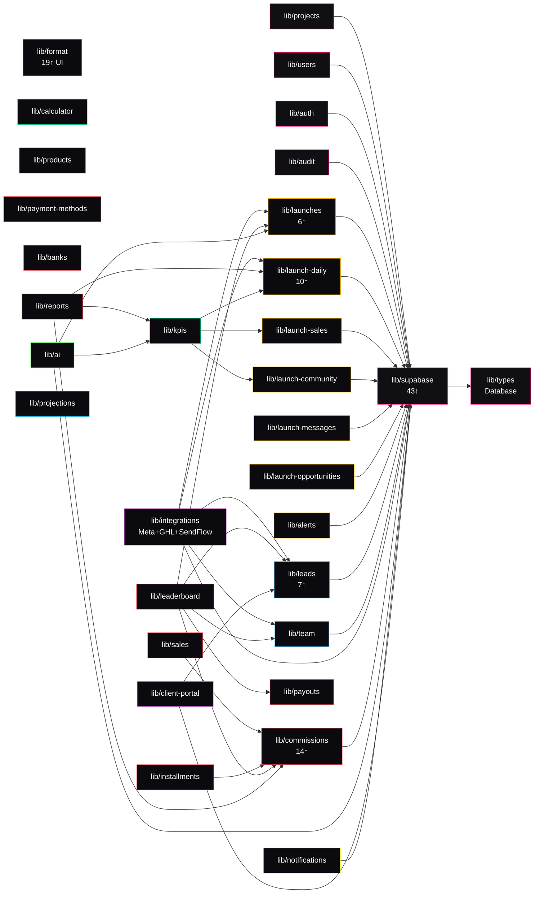

# 07 · Mapa de acoplamientos y modularización

Este es el paso que define la viabilidad de la migración. Objetivo: dar una respuesta honesta a "qué se puede extraer, qué es genuinamente compartido, y qué asume que LaunchOS es la app raíz".

**Recomendación general**: no intentar "extraer módulos independientes" físicamente. LaunchOS es **un dominio de negocio bien acoplado sobre un tenant común** (proyecto). Extraerlo como submódulo de una plataforma más grande es viable, pero las 34 tablas y el pipeline (leads → sales → payments → commissions → leaderboard) tienen que quedar en un mismo esquema de DB. La modularización útil es **de código**, no de datos.

Todo lo que sigue afirma sobre archivos leídos. Cero suposiciones.

---

## 7.1 Grafo de dependencias entre módulos

### 7.1.1 Import counts entre subcarpetas de `src/lib/`

`grep` de `^import .* from '@/lib/…'` dentro de `src/lib`:

| Módulo importado | # imports desde otros lib/ |
| --- | ---: |
| `@/lib/supabase` | **43** |
| `@/lib/commissions` | 14 |
| `@/lib/launch-daily` | 10 |
| `@/lib/leads` | 7 |
| `@/lib/kpis` | 7 |
| `@/lib/types` (Database) | 7 |
| `@/lib/launches` | 6 |
| `@/lib/team` | 4 |
| `@/lib/products`, `@/lib/payouts`, `@/lib/launch-sales` | 2 cada uno |
| `@/lib/calculator`, `@/lib/format` | 2 cada uno |
| `@/lib/alerts`, `@/lib/projections`, `@/lib/payment-methods` | 1 cada uno |

### 7.1.2 Imports desde components/ (UI a lib/)

| Módulo importado | # imports desde components/ |
| --- | ---: |
| `@/lib/format` | **19** |
| `@/lib/team` | 11 |
| `@/lib/commissions` | 11 |
| `@/lib/supabase` | 10 |
| `@/lib/products` | 9 |
| `@/lib/payment-methods`, `@/lib/leads` | 7 cada uno |
| `@/lib/launches`, `@/lib/banks` | 6 cada uno |
| `@/lib/theme` | 5 |
| `@/lib/integrations` | 5 |
| `@/lib/projects` | 4 |
| `@/lib/launch-daily`, `@/lib/kpis`, `@/lib/installments`, `@/lib/calculator`, `@/lib/leaderboard` | 3-4 cada uno |
| `@/lib/notifications`, `@/lib/launch-sales`, `@/lib/auth`, `@/lib/ai` | 1 cada uno |

### 7.1.3 Grafo condensado (Mermaid)

Sin ciclos detectados. Todo fluye "hacia arriba" al core (`supabase`, `types`) y a los agregadores (`kpis`, `reports`, `leaderboard`).

Hot spots — módulos que si se rompen le pegan a **todo**:
- `@/lib/supabase` (auth + clientes)
- `@/lib/format` (formatters de dinero, fechas — 19 componentes)
- `@/lib/commissions` (14 imports en lib + 11 en componentes)

---

## 7.2 Propuesta de límites de módulo (validada contra el código)

8 módulos + 1 core + 1 shared. Marcados con dificultad de extracción **si el objetivo es sacar el código a un package aparte**.

### 7.2.1 `core/` — auth, tenancy, permisos, chrome (dificultad: **baja**)

**Qué**: todo lo que resuelve "quién sos, a qué tenant pertenecés, qué podés hacer" + shell base + design system.

Archivos:
- `src/lib/supabase/{auth, server, client, service, middleware}.ts`
- `src/lib/auth/{permissions, actions}.ts`
- `src/lib/projects/{list, aggregates}.ts`
- `src/lib/users/*`
- `src/lib/audit/*` (audit_log + auth_events)
- `src/lib/theme.ts`, `src/lib/theme-cookie.ts`
- `src/app/globals.css` (tokens)
- `src/app/layout.tsx` (root)
- `src/components/ui/*` (primitivas)
- `src/components/dashboard/{shell, topbar, sidebar, mobile-sidebar, nav-link, nav-group, user-menu, shell-context, sidebar-toggle, project-switcher}.tsx`
- `src/components/notifications/notification-bell.tsx` (con reservas — usa `/api/notifications`)
- `src/lib/notifications/*`
- Tablas DB: `profiles`, `projects`, `project_members`, `audit_log`, `auth_events`, `notifications`.
- Migraciones: 0001, 0002, 0003, 0005 (soft-delete), 0023 (frontier cliente), 0024, 0026, 0027, 0034 (dev+audit).

**Depende de**: nada.
**Es dependido por**: todos.
**Difícil de extraer porque**: es la base. **Fácil de mover** al "core" de la plataforma grande.

### 7.2.2 `shared/` — utilidades puras (dificultad: **baja**)

Archivos:
- `src/lib/format.ts` (fmt Money, Date, Number, Percent — 19 consumidores UI)
- `src/lib/kpis.ts` (funciones puras)
- `src/lib/calculator/*` (reverse/forward puros)
- `src/lib/types/database.ts`
- `src/lib/test-shims/*`

**Depende de**: `kpis` importa tipos de `launch-sales`, `launch-community`, `launch-daily` — hay que revisitar si estos tipos van a shared o si `kpis` ingiere un shape genérico. Refactor menor.

### 7.2.3 `launches/` — el core de LaunchOS (dificultad: **alta** por gravedad, no por acoplamiento hacia afuera)

**Qué**: el objeto "lanzamiento" es el hub. Todo cuelga de él.

Archivos:
- `src/lib/launches/*` (list, get, calendar, evergreen)
- `src/lib/launch-daily/*` (aggregate, merge, list, export-csv)
- `src/lib/launch-sales/*` (agregado kanban)
- `src/lib/launch-community/*` (agregado SendFlow)
- `src/lib/launch-messages/*` (Fase B mensajes)
- `src/lib/launch-opportunities/*` (agregado GHL opps, hoy sin uso en KPI)
- `src/lib/alerts/*` (reglas por launch)
- `src/lib/projections/*` (calculadora asociada a proyecto/launch — decidir si vive acá o en calculator/)
- `src/components/dashboard/launches/*` (22 archivos, 3 643 LOC — form, KPI grid, alertas UI, integraciones UI)
- `src/app/(app)/proyectos/[projectId]/launches/**`
- Migraciones: 0001 (launches base), 0006, 0011, 0037 (calendario), 0012 (integrations meta), 0022 (opps), 0025 (alerts), 0028 (evergreen), 0029 (community), 0033 (revenue split), 0035 (messages).
- Tablas: `launches`, `launch_daily`, `launch_daily_ads`, `launch_secrets`, `launch_opportunities`, `launch_community_metrics`, `launch_messages_daily`, `alert_rules`, `integration_runs`.

**Depende de**: `core`, `shared`, `integrations` (para syncs).
**Es dependido por**: `sales` (via `sale.launch_id`), `crm` (via `lead.launch_id`), `ai` (via `ai_runs.launch_id`), `commissions` (via override por launch).

**Extracción real**: no tiene sentido como package aparte — está en el centro del grafo. Sí tiene sentido como **subcarpeta clara** dentro del monorepo/proyecto.

### 7.2.4 `crm/` — leads + kanban + GHL (dificultad: **alta**)

Archivos:
- `src/lib/leads/*` (9 archivos: import, search, dedup, types)
- `src/lib/team/*` (team_members)
- `src/components/dashboard/leads/*` (6 archivos, 2 163 LOC — kanban, table, form, import wizard)
- `src/components/dashboard/team/*`
- `src/app/(app)/proyectos/[projectId]/{leads,equipo}/**`
- Migraciones: 0013 (equipo+leads), 0016 (leads at scale), 0017 (GHL integration), 0018 (kanban statuses), 0021 (ghl user mappings).
- Tablas: `leads`, `team_members`, `ghl_user_mappings`.

**Depende de**: `core`, `launches` (leads pueden pertenecer a un launch), `integrations/ghl` (via `sync-ghl`), `shared` (format, kpis para conversion rate).
**Es dependido por**: `sales` (leads → sales), `client-portal` (leads read-only).

**Difícil de extraer porque**: tiene doble face — es tabla de datos (leads) **y** hub del pipeline (feeds sales). El componente `kanban-board.tsx` (502 LOC) mezcla data-model (lead status) con drag-drop UI + sale creation (a través de `sale-modal`) — hay que separar UI del pipeline.

### 7.2.5 `sales/` — el módulo más tangled (dificultad: **alta**)

Archivos:
- `src/lib/sales/*`, `src/lib/commissions/*` (6 archivos), `src/lib/installments/*`, `src/lib/banks/*`, `src/lib/payment-methods/*`, `src/lib/products/*`, `src/lib/payouts/*`
- `src/lib/leaderboard/*`
- `src/lib/reports/*` (executive PDF y commissions PDF)
- `src/components/dashboard/{sales,commissions,payment-methods,products,team,banks,leaderboard}/*`
- `src/app/(app)/proyectos/[projectId]/{ventas,cobros,comisiones,productos,metodos-pago,bancos,leaderboard}/**`
- `src/app/(app)/proyectos/[projectId]/launches/[launchId]/cobros/**`
- API: `/api/proyectos/…/report/commissions`, `/api/proyectos/…/report/executive`.
- Migraciones: 0014 (sales+commissions), 0030 (payouts), 0031, 0032, 0038, 0039, 0040, 0041, 0042, 0043, 0044, 0045, 0046, 0047.
- Tablas: `sales`, `payments`, `payment_modalities`, `commission_rules`, `commission_rule_tiers`, `commission_rule_modalities`, `products`, `payment_methods`, `installments`, `banks`, `bank_movements`, `team_member_payouts`.

**Depende de**: `core`, `launches`, `crm/leads`, `crm/team`, `shared`.
**Es dependido por**: `client-portal` (revenue KPIs pero no comisiones), `ai` (via KPIs derivados).

**Difícil de extraer porque**: es el corazón de plata + el más largo (5 archivos > 800 LOC). Los 4 accrual modes de comisiones + tiers + snapshots + multi-sale por lead son un dominio complejo por sí solo. Buen candidato a **submodulo pero como una unidad** — no partir "commissions" de "installments".

### 7.2.6 `integrations/` — proveedores externos (dificultad: **media**)

Archivos:
- `src/lib/integrations/{ghl, sync-ghl, sync, meta, sendflow, ghl-match, ghl-messages, runs, instructions/*}.ts`
- `src/lib/integrations/__fixtures__/*` (JSON reales para tests)
- Server Actions: `src/app/(app)/proyectos/[projectId]/launches/[launchId]/sync-actions.ts` (506 LOC)
- API probe: `src/app/api/proyectos/…/probes/ghl-messages/route.ts`
- `src/components/dashboard/launches/integrations/*`
- Migraciones: 0012, 0017, 0019, 0020, 0021, 0029, 0035.
- Tablas: `integration_runs`, `project_integrations`, `launch_secrets`, `project_secrets`, `ghl_user_mappings`.

**Depende de**: `core`, `launches`, `crm/leads`, `crm/team`, `sales/opps` (para GHL opps).
**Es dependido por**: `launches` (indirecto — el sync escribe en las tablas de launches).

**Extracción media** porque los adapters (`meta.ts`, `ghl.ts`, `sendflow.ts`) están **muy limpios** — 4 archivos client-only con fixtures. Lo que ata es el **orchestrator** (`sync.ts`, `sync-ghl.ts`) que decide qué escribir en qué tabla. Refactor: separar `adapters/` puros de `orchestrator/` que conoce el schema. Ganancia: los adapters son piezas testeables e intercambiables.

### 7.2.7 `ai/` — resúmenes ejecutivos (dificultad: **baja**)

Archivos:
- `src/lib/ai/{client, summarize-launch, list-runs, types}.ts`
- Server Actions: `src/app/(app)/proyectos/[projectId]/launches/[launchId]/ai-actions.ts`, `src/app/(cliente)/portal/proyectos/[projectId]/launches/[launchId]/ia/actions.ts`
- Componentes: `src/components/dashboard/launches/ai/*`, `src/components/client-portal/client-ai-trigger.tsx`
- Rutas: `.../launches/[launchId]/ia/page.tsx`, `.../portal/…/ia/page.tsx`
- Migración: 0015 (`ai_runs`).
- Tabla: `ai_runs`.

**Depende de**: `core`, `launches`, `shared` (para KPIs alimentados al prompt).
**Es dependido por**: nadie (endpoint terminal — muestra el resultado).

**Extracción real fácil** porque el provider abstraction (`ai/client.ts`) es un solo archivo, el prompt es otro, y `ai_runs` es una tabla siloed. Cambiar de OpenAI a Anthropic o a Vercel AI Gateway → 1 archivo. Portable a la plataforma grande **como el módulo "IA de LaunchOS"** — o subir un nivel y ser el "AI de la plataforma".

### 7.2.8 `client-portal/` — cara al cliente final (dificultad: **baja** en código, **media** por producto)

Archivos:
- `src/app/(cliente)/**` (route group + layout + 8 rutas)
- `src/app/api/portal/**` (2 endpoints: report/executive, leads/export)
- `src/lib/client-portal/*` (4 archivos, 357 LOC — leads reducidos + exports)
- `src/components/client-portal/*` (6 archivos, 309 LOC — shell + nav + trigger IA)
- Migración 0023 (rol Postgres `cliente_role` + column-level grants).

**Depende de**: `core` (auth+tenant), `launches` (read-only KPIs), `crm/leads` (read-only view + column filter), `sales` (revenue KPIs sin team_member_id), `ai` (endpoint compartido).

**Extracción real**: es el módulo **más pequeño y más autónomo** (1 154 LOC en rutas + 309 en componentes). Se puede sacar como un **microfrontend** o **subdominio** aparte, pero tiene que compartir la sesión de Supabase (misma cookie domain — ver § 7.5).

### 7.2.9 Módulos "dobles" o difusos

- **`notifications`**: tabla + notification-bell. Hoy vive medio en core y medio en integrations. Propongo dejarla en **core** — es transversal y el bell aparece en todos los shells.
- **`calculator`**: reverse/forward puros + projections. Hoy sirve a admin y a cliente. Propongo dejarla en **shared** salvo que Growins la quiera abrir a otros dominios de la plataforma.

---

## 7.3 Qué es genuinamente compartido (candidato al core de la plataforma)

Lo que debería **subir un nivel** a la plataforma grande (`platform-core`) porque no es específico de LaunchOS:

- **Auth + sesión**: Supabase clientes, `getSessionProfile`, `requireX`, roles global. Toda la plataforma va a usarlos.
- **Tenancy**: `projects`, `project_members`, el hook `custom_access_token_hook` (rol Postgres cliente_role). Va a manejar los tenants a nivel plataforma, no de LaunchOS.
- **Permisos**: helpers SECURITY DEFINER `is_superadmin`, `has_project_access`, `can_edit_project`, `can_edit_launches_in`, `is_cliente`, `is_dev`. Comparten el mismo modelo de "quién puede qué" en toda la plataforma.
- **Design system**: `globals.css` @theme, `ui/*` primitivas, Inter, tokens de color. Un solo look en toda la suite.
- **Layout base**: shell, topbar, sidebar, user menu, project switcher, mobile sidebar. Todo dashboard interno lo usa.
- **Notifications**: `notifications` tabla + `create_notification` RPC + notification-bell. Cross-module.
- **Format utilities**: `fmtMoney`, `fmtDate`, `fmtPercent`, etc. (19 componentes UI dependen).
- **KPI helpers puros** (`safeDiv`, `safeNumber`, `safePercent`).
- **Audit log** + `record_audit` trigger.
- **Client Supabase** (browser y server) — un solo package.

---

## 7.4 Qué es específico de LaunchOS (vive en el subdominio)

- El objeto **launch** completo (schema + UI + KPIs).
- **Calendario de fases** (Fase 2b) — nada más de la plataforma usa esta noción.
- **Ads** — Meta insights, `launch_daily_ads`, `launch_daily`.
- **CRM de leads** — mientras Growins no unifique CRM con otro dominio.
- **Kanban** — tablero.
- **Sales/commissions/installments/banks** — todo el pipeline financiero **está pensado por launch**. Si Growins tuviera una "vista financiera consolidada" a nivel plataforma, tendría que leer de estas tablas — pero el modelo de negocio no vive fuera de LaunchOS hoy.
- **SendFlow** (comunidades WhatsApp).
- **AI summary** — hoy es "resumen del launch". Si mañana la plataforma tiene "resumen del proyecto entero", se sube.
- **Portal cliente** — la salida a clientes finales de este subdominio (si la plataforma tiene otros subdominios que expongan cara-cliente, hay que consolidar).

---

## 7.5 Puntos donde LaunchOS asume que es la app raíz

Este es el material del blast radius al pasar a subdominio. **Lista dura**.

### 7.5.1 Rutas hardcodeadas que asumen `/` como home del sistema

Grep exacto de `redirect(...)` en `src/`:

| Archivo:línea | Target | Semántica |
| --- | --- | --- |
| `src/lib/supabase/auth.ts:96` | `redirect("/login")` | Sesión ausente → login |
| `src/lib/supabase/auth.ts:110` | `redirect("/")` | Rol no autorizado → home |
| `src/lib/supabase/auth.ts:150,165` | `redirect(`/proyectos/${projectId}`)` | Falta permiso → detail proyecto |
| `src/lib/auth/actions.ts:34` | `redirect("/login")` | signOut |
| `src/app/(app)/layout.tsx:24` | `redirect("/portal")` | cliente entra al `(app)` → portal |
| `src/app/(app)/proyectos/[projectId]/layout.tsx:32` | `redirect("/")` | proyecto inexistente/inacc → home |
| `src/app/(app)/calculadora/page.tsx:18` | `redirect("/")` | !canUseCalculator |
| `src/app/(app)/proyectos/[projectId]/{ventas,cobros,equipo,leaderboard,leads}/page.tsx` | `redirect(`/proyectos/${projectId}`)` | cliente cae al overview del proyecto |
| `src/app/(app)/proyectos/[projectId]/{comisiones,bancos,metodos-pago,productos}/page.tsx` | `redirect(`/proyectos/${projectId}`)` | !canEdit |
| `src/app/(app)/proyectos/[projectId]/analitica/page.tsx:67` | `redirect(`/portal/proyectos/${projectId}`)` | cliente al portal (raro cruzado) |
| `src/app/(app)/proyectos/[projectId]/audit/page.tsx:26` | `redirect(`/proyectos/${projectId}`)` | acceso denegado |
| `src/app/(cliente)/layout.tsx:25` | `redirect("/")` | Rol ≠ cliente → home |
| `src/app/(cliente)/portal/page.tsx:30` | `redirect(`/portal/proyectos/${...}`)` | picker → único proyecto |
| `src/app/(cliente)/portal/proyectos/[projectId]/layout.tsx:31` | `redirect("/portal")` | proyecto inacc → home portal |
| `src/app/(auth)/set-password/actions.ts:40` | `redirect("/")` | password seteada → home |
| `src/app/(auth)/login/actions.ts:48` | `redirect("/")` | login OK → home |
| `src/app/(admin)/admin/proyectos/actions.ts:60,85,100` | `redirect("/admin/proyectos")` | CRUD proyecto |
| `src/app/(app)/proyectos/[projectId]/launches/actions.ts:204,299,361` | `redirect(`/proyectos/${projectId}/launches/…`)` | CRUD launch |
| `src/app/(app)/proyectos/[projectId]/launches/[launchId]/page.tsx:13` | `redirect(`/proyectos/${projectId}/launches/${launchId}/kpi`)` | root del launch → tab KPI |

**Impacto por escenario**:

- Si LaunchOS queda montado como `launch.growins.com/`: **cero cambios** — todos los `/...` funcionan.
- Si LaunchOS se monta como `platform.growins.com/launch/…`: hay que setear `basePath = "/launch"` en `next.config.ts`. Next.js lo maneja transparentemente para `redirect()`, `<Link href>`, y `router.push`. Pero **las URLs que se emitan como strings** (por ejemplo, en emails o en los `href={api/…}`) siguen sin prefix. Todos los `href={/api/proyectos/...}` en `layout.tsx:158,166` y `kpi/page.tsx:104` deberían prefijarse.
- Si LaunchOS convive como subdominio y necesita "volver a la home de plataforma": no hay `redirect("/")` que apunte a la plataforma. Todos los "/" van a la home de LaunchOS. Hay que introducir `PLATFORM_HOME_URL` en env y usarlo en 3-4 lugares (post-login, no-permitido).

### 7.5.2 Cookies y sesión

- **`SESSION_TRACK_COOKIE`** (`src/lib/supabase/middleware.ts:14,81-86`): `path: "/"`, **sin `domain`**. Cookie scoped al host actual.
- **`THEME_COOKIE`** (`src/lib/theme.ts`, escrito por `src/app/theme-actions.ts`): idem — scoped al host.
- **Cookies de Supabase Auth** (manejadas por `@supabase/ssr`): las setea con `options` provisto por Supabase. Por defecto scoped al host.

**Problema real para subdominio + SSO cross-subdominios**:

Para que un usuario logueado en `admin.growins.com` esté logueado también en `launch.growins.com`, la cookie de auth **tiene que ser `Domain=.growins.com`**. Hoy no lo es (los archivos anteriores nunca pasan `domain: '.growins.com'`).

Cambio necesario:

- En `src/lib/supabase/middleware.ts:47-48` y `src/lib/supabase/server.ts:26` — al setear cookies, extender `options` con `domain: process.env.NEXT_PUBLIC_COOKIE_DOMAIN ?? undefined`.
- Nueva env: `NEXT_PUBLIC_COOKIE_DOMAIN` (`.growins.com` en prod, undefined en localhost).
- Idem para `SESSION_TRACK_COOKIE` (`middleware.ts:81`) y `THEME_COOKIE`.

Es cambio localizado (~4 líneas) pero **crítico** para cualquier SSO en la plataforma. Anotado en `08-riesgos.md`.

### 7.5.3 URLs absolutas / callbacks de OAuth

- `src/app/auth/confirm/route.ts:33-59` deriva el `origin` del `request.url` (no de env). ✅ Portable.
- `NEXT_PUBLIC_APP_URL` **declarada en `.env.example` pero no referenciada en código** (`01-estructura.md § 1.6`). Actualmente muerta.
- Los templates de invitación de Supabase Auth (config en el Dashboard remoto) **sí** usan un `SITE_URL` que apunta a la app. Si LaunchOS cambia de host, el template hay que actualizarlo en el dashboard de Supabase.

### 7.5.4 Webhooks

No hay endpoints de webhook entrantes. Meta / GHL / SendFlow **no** llaman a LaunchOS. Se sondean vía sync manual. ✅

### 7.5.5 Auth de terceros

No hay OAuth de Meta / GHL / Google. Los tokens son PIT/API-key manuales en `launch_secrets`. No hay callback URLs en el dashboard de LaunchOS ni en providers. ✅

---

## 7.6 Contratos a estabilizar antes de partir el código

Los tipos y shapes que **deberían quedar en un package `contracts/` compartido**:

| Contrato | Archivo actual | Consumers |
| --- | --- | --- |
| `Database` (schema Supabase) | `src/lib/types/database.ts` (1 460 LOC autogen) | Todos |
| `SessionProfile` + `Role` | `src/lib/supabase/auth.ts:7-26` | Layouts, guards, componentes |
| `LaunchKPIInput`, `LaunchKPIOptions`, `LaunchKPIs` | `src/lib/kpis.ts:48-170` | PDFs, IA, cliente portal, dashboard |
| `LaunchCalendar`, `LaunchCalendarInputs` | `src/lib/launches/calendar.ts:36-80` | Form, detail, PDF |
| `LeadRow`, `LeadStatus`, `LeadSource`, `LEAD_STATUSES` | `src/lib/leads/types.ts` | Kanban, table, sync-ghl, sale-modal |
| `SaleRow`, `PaymentRow`, `CommissionRuleRow`, `CommissionRuleSnapshot` | `src/lib/commissions/types.ts` | Sales, leaderboard, PDFs, kanban |
| `IntegrationStatusForProvider`, `RunStatus`, `RunStage` | `src/lib/integrations/runs.ts:60-91` | Runs UI, sync UI |
| `NotificationRow`, `NotificationSeverity` | `src/lib/notifications/types.ts` | Bell, alerts |

Recomendación: antes de mover código, **congelar estos tipos**. Si el subdominio quiere cambiarlos, negocia con el core.

---

## 7.7 Dificultad de extracción — resumen

| Módulo | Dificultad | Motivo |
| --- | --- | --- |
| `core` | Baja | Auth+layout+design system. Ya está aislado; se mueve al package "platform-core" tal cual. |
| `shared` (format, kpis, calc) | Baja | Utilidades puras. |
| `ai` | Baja | Provider abstraction en 1 archivo + tabla siloed. |
| `client-portal` | Baja (código) / Media (producto) | Superficie chica, guard column-level. Portable como subdominio. |
| `community` (SendFlow) | Media | Bajo acoplamiento. Sólo `launch_community_metrics` en DB. |
| `integrations` | Media | Adapters limpios; orchestrator conoce todo el schema. |
| `crm` (leads + kanban) | Alta | El kanban mezcla data model + UI + sale creation. |
| `launches` | Alta | Hub del grafo. Salir es partirse la spine. |
| `sales` (con commissions, installments, banks, leaderboard, reports) | Alta | Dominio complejo, 12 tablas, evolución en 15+ migraciones. |

**Recomendación de orden de extracción** (menor a mayor riesgo):

1. **shared** + **core** — se llevan primero al package platform-wide. Cero riesgo funcional.
2. **ai** — provider abstraction independiente.
3. **client-portal** — puede vivir en subdominio distinto compartiendo Supabase.
4. **community** (SendFlow) — módulo autónomo pequeño.
5. **integrations** (meta, ghl, sendflow adapters) — separar adapters de orchestrator.
6. **launches + ads** — se quedan juntos como el núcleo del subdominio.
7. **crm** + **sales** — se quedan juntos, no vale la pena partirlos por lo que ya vimos en `05-negocio.md § 5.3`.

**Alto riesgo** de partir cualquier módulo al medio: **atribución (`lead.team_member_id` ↔ `sale.team_member_id`), reconciliación de revenue (kanban + manual), y comisiones sobre cobrado con multi-venta**. Toda esa lógica es **transversal a `crm` + `sales` + `launches`** y no se parte sin duplicar cálculos o coordinar contratos con `contracts/`.

---

## 7.8 Estrategias concretas para el subdominio

### Opción A — Un solo Vercel project, subdominio `launch.growins.com`

- Toda LaunchOS vive en un subdominio.
- Cookie domain `.growins.com` → SSO con otros subdominios.
- Supabase compartido con la plataforma grande.
- Cambios: cookie domain, quizás `PLATFORM_HOME_URL` para volver al home de plataforma post-logout.

Ventajas: rápido, mínimo blast radius. Desventaja: si `admin.growins.com` y `launch.growins.com` comparten componentes de UI (chrome), hay duplicación entre proyectos Vercel.

### Opción B — Monorepo Turborepo con packages

- `packages/platform-core` (auth, shell, design system).
- `packages/launch-os` (todo el dominio actual).
- `packages/admin` (nueva).
- `packages/finance` (nueva).
- `packages/client-portal` (opcionalmente separado).
- Cada app Next.js consume los packages.

Ventajas: reuso real. Desventaja: build más largo, coordinación entre versionados.

Skill de Vercel disponible: `vercel:next-forge` para monorepo, `vercel:microfrontends` si se quiere ir a arquitectura de multi-zone.

### Opción C — Microfrontend con `@vercel/microfrontends`

- LaunchOS es un `microfrontends.json` bajo `platform.growins.com/launch/…`.
- Otros microfrontends bajo `/admin`, `/finance`, `/client`.
- Sesión compartida por cookie domain.

Ventajas: unifica navegación bajo un solo dominio. Desventaja: complejidad de proxy y deploys coordinados.

---

## ⚠️ No pude determinar

- **Si Growins ya decidió** subdominio vs. `basePath` vs. microfrontend. La respuesta cambia el tamaño del refactor.
- **Si el resto de la plataforma va a usar Supabase** — si no, el diseño del core cambia radicalmente (habría que salir a otro auth provider).
- **Si `NEXT_PUBLIC_APP_URL` (hoy muerta) va a activarse** para armar URLs absolutas en emails de notificaciones o resúmenes. Punto de decisión.
- **Si `admin/proyectos` va a viajar con LaunchOS** o a la plataforma general. Superadmin (crear clientes) es transversal.
